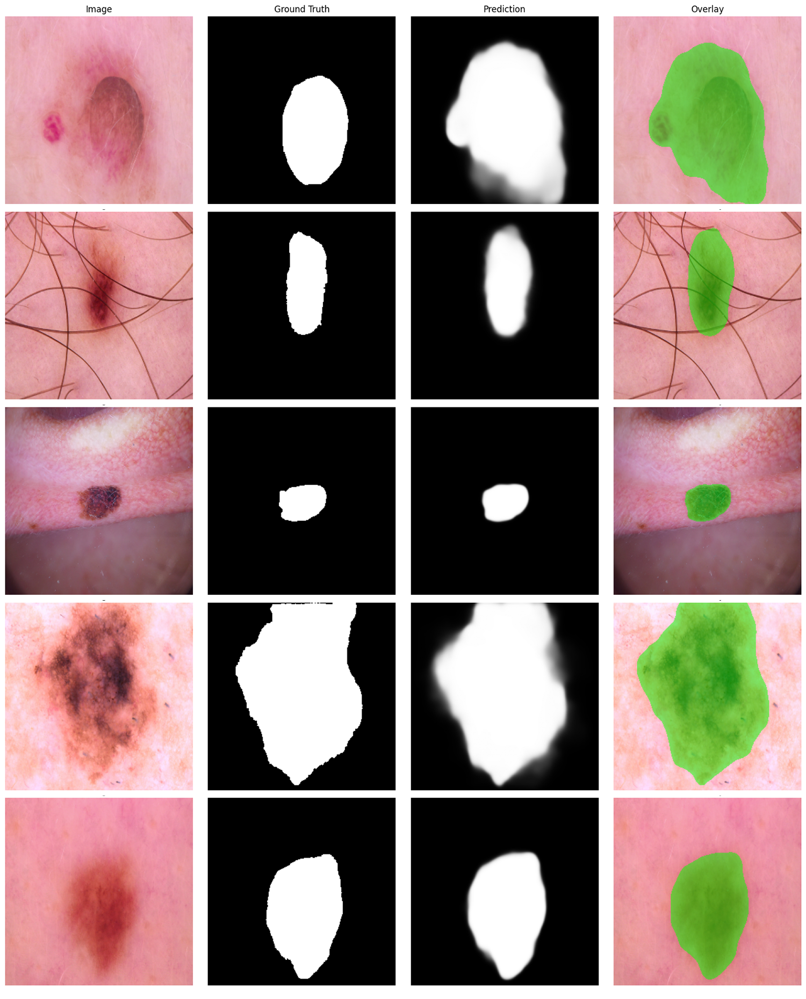

<div align="center">


<br/>

# GhostMTFormer

### Lightweight Dual-Encoder Network for Precise Skin Lesion Segmentation

*GhostNet · Cross-Attention · Boundary Refinement · Deep Supervision · Grad-CAM*

<br/>

[](https://python.org)
[](https://pytorch.org)
[](https://developer.nvidia.com/cuda-toolkit)
[](LICENSE)
[](https://dataverse.harvard.edu/dataset.xhtml?persistentId=doi:10.7910/DVN/DBW86T)

<br/>

| Metric | Score |
|:------:|:-----:|
| **Dice** | **94.00%** |
| **IoU** | **89.63%** |
| **HD95** | **3.24 px** |
| **Parameters** | **61.74M** |

</div>

---

## About the Project

Skin lesion segmentation is a critical first step in automated melanoma diagnosis. Two core challenges make it hard:

1. **Boundary ambiguity** — lesion edges are often low-contrast, irregular, and visually similar to surrounding skin
2. **Scale of context** — a model needs fine local texture *and* global lesion shape simultaneously

Most hybrid architectures solve this by stacking heavy transformer components on top of CNN backbones — making them impractical for clinical deployment on constrained hardware.

**GhostMTFormer addresses both challenges efficiently: a dual-encoder design with lightweight Ghost modules, multi-scale cross-attention, and explicit boundary refinement — achieving 94% Dice and 3.24px HD95 on HAM10000 at 61.74M parameters.**

---

## Architecture

GhostMTFormer follows an **encoder → cross-attention → fusion → decoder** paradigm with five key design decisions:

### 1. Dual Encoder
Two complementary encoders run in parallel on the same input:

| Encoder | Role | Key mechanism |
|---------|------|---------------|
| **GhostNet encoder** | Local texture, fine edges, colour transitions | Ghost modules — cheap linear ops generate extra feature maps at 50% fewer FLOPs |
| **Global CNN encoder** | Lesion shape, extent, long-range structure | Dilated convolutions (rates 1, 2, 4, 8) expand receptive field without downsampling |

### 2. CFCA — Cross-Feature Cross-Attention
At **three spatial scales**, features from both encoders exchange information bidirectionally:

```
Ghost f2 (local)  ←→  Global t1 (context)   [scale 1 — 64×64]
Ghost f3 (local)  ←→  Global t2 (context)   [scale 2 — 32×32]
Ghost f4 (local)  ←→  Global t3 (context)   [scale 3 — 16×16]
```

Each CFCA module applies **Efficient Channel Attention (ECA)** before attention — recalibrating which channels matter before the cross-stream exchange. Spatial pooling to 16×16 keeps attention tractable regardless of input resolution.

### 3. XFF Bottleneck
The deepest features from both encoders are projected to a shared dimension, fused element-wise, and refined through a dual conv block with ECA. This produces a **compact 1024-channel representation** encoding both local and global cues.

### 4. Boundary-Refined Decoder
Four upsampling stages recover spatial resolution using GhostNet skip connections. After each stage, a **Boundary Refinement Module (BRM)**:
- Predicts a coarse boundary probability map
- Uses it as a soft attention gate on the feature map
- Forces intermediate representations to align with lesion contours

This is the mechanism that drives HD95 from the initial baseline down to **3.24px**.

### 5. Deep Supervision + Multi-Task Heads
- **Segmentation head** — primary binary mask output
- **Edge detection head** — auxiliary boundary supervision during training
- **Deep supervision** at decoder stages 1, 2, 3 — every layer receives gradient signal directly, preventing vanishing gradients in early stages

---

## Results

### HAM10000 Test Set (1,002 images, with TTA)

```
  Dice  :  93.998% ± 8.65%
  IoU   :  89.630% ± 11.89%
  HD95  :  3.24 px
  Params:  61.74M
```

### Evaluation Metrics — What They Mean

| Metric | Full Name | What it measures | Better when |
|--------|-----------|-----------------|-------------|
| **Dice** | Sørensen–Dice Coefficient | Overlap between predicted mask and ground truth — computed as `2·\|P∩G\| / (\|P\|+\|G\|)`. Ranges 0→1. Penalises both missing lesion pixels and predicting too much. | Higher ↑ |
| **IoU** | Intersection over Union (Jaccard Index) | Stricter than Dice — computed as `\|P∩G\| / \|P∪G\|`. Any pixel predicted outside the true lesion is penalised more heavily. | Higher ↑ |
| **HD95** | 95th Percentile Hausdorff Distance | Boundary precision — measures the 95th percentile of all surface distances between the predicted contour and the ground truth contour, in pixels. A small HD95 means the predicted boundary closely matches the true lesion edge. | Lower ↓ |

> Two models can have similar Dice scores but very different HD95 values — a model can correctly identify the lesion region while still producing jagged or shifted boundaries. HD95 captures what Dice cannot.

### Prediction Samples



*Each row: original dermoscopic image · ground truth mask · predicted mask · overlay*

### Explainability


Each row shows: **Original image → Ground truth → Prediction → Grad-CAM heatmap → Uncertainty map**

- **Grad-CAM** — red/yellow regions confirm the model attends to lesion boundaries, not background
- **Uncertainty** — bright pixels mark ambiguous edges where model confidence is lower, useful for flagging cases for expert review

---

## Training Details

| Hyperparameter | Value |
|----------------|-------|
| Optimizer | AdamW |
| Learning rate | 3e-4 (cosine decay) |
| Weight decay | 3e-5 |
| Epochs | 100 |
| Batch size | 8 |
| Image size | 256 × 256 |
| Mixed precision | ✅ FP16 |
| Grad clip | 1.0 |

### Loss Function
Training uses a combination of five complementary objectives, each targeting a different weakness in segmentation:

```
L = λ₁·Dice + λ₂·BCE + λ₃·Tversky(α=0.3, β=0.7) + λ₄·Focal(γ=2) + λ₅·Boundary
```

| Loss | Role | Why it's needed |
|------|------|-----------------|
| **Dice** | Global region overlap | Directly optimises the evaluation metric. Encourages the model to find the full lesion region rather than individual pixels. Scale-invariant — works equally well on large and small lesions. |
| **BCE** | Pixel-wise supervision | Binary Cross-Entropy provides stable, independent supervision for every pixel. Acts as a reliable baseline that prevents Dice from collapsing during early training. |
| **Tversky** | False negative control | A generalisation of Dice with separate penalties for false positives (α=0.3) and false negatives (β=0.7). By setting β > α, the model is penalised harder for missing lesion pixels than for predicting slightly too much — critical in medical imaging where missed regions are more dangerous than over-segmentation. |
| **Focal** | Hard pixel mining | Down-weights the loss contribution from easy, well-classified pixels (healthy skin far from the lesion) and concentrates training signal on hard pixels near ambiguous boundaries. γ=2 is the standard setting that achieves this reweighting effect. |
| **Boundary** | Contour precision | Computes loss exclusively on pixels within a small ring around the true lesion edge (via morphological dilation minus erosion). Directly supervises the boundary pixels that determine HD95, complementing the region-level Dice and Tversky objectives. |

### Test-Time Augmentation (TTA)

At inference, each image is passed through the model **four times** with different orientations, and the predictions are averaged:

```
Original          →  prediction 1
Horizontal flip   →  prediction 2  (flipped back)
Vertical flip     →  prediction 3  (flipped back)
Both flips        →  prediction 4  (flipped back)

Mean of all four  →  final mask
```

TTA removes orientation bias — the model may be slightly more confident about a boundary from one viewing angle than another. Averaging the four predictions produces a smoother, more accurate final mask. This is done only at evaluation (no extra training required) and typically improves Dice by 0.5–1.5% and HD95 by 1–3px.

### Data Augmentation

| Augmentation | Probability |
|---|---|
| Horizontal flip | 0.5 |
| Vertical flip | 0.5 |
| Rotation ±30° | 0.5 |
| Random resized crop | 0.4 |
| Colour jitter | 0.5 |
| Gaussian noise | 0.2 |
| Elastic transform | 0.2 |
| Grid distortion | 0.2 |

---

## Dataset

**HAM10000** — Human Against Machine with 10,000 training images

A large publicly available collection of multi-source dermoscopic images of common pigmented skin lesions. Contains 10,015 images with expert-annotated binary segmentation masks, covering 7 diagnostic categories: melanoma, melanocytic nevus, basal cell carcinoma, actinic keratosis, benign keratosis, dermatofibroma, and vascular lesions.

| Split | Images |
|-------|--------|
| Train | 8,012 |
| Val | 1,001 |
| Test | 1,002 |

**Source:** [Harvard Dataverse — HAM10000](https://dataverse.harvard.edu/dataset.xhtml?persistentId=doi:10.7910/DVN/DBW86T)

Place downloaded files at:
```
data/raw/
├── images/          ← all 10,015 .jpg images
├── masks/           ← all _segmentation.png masks
└── HAM10000_metadata.csv
```

---

## Project Structure

```
GhostMTFormer/
│
├── configs/
│   └── default.yaml              ← all hyperparameters in one place
│
├── src/
│   ├── dataset.py                ← HAM10000 pipeline, augmentations, dataloaders
│   ├── losses.py                 ← Dice, BCE, Tversky, Focal, Boundary losses
│   ├── metrics.py                ← Dice, IoU, HD95
│   ├── train.py                  ← training loop, mixed precision, checkpointing
│   ├── evaluate.py               ← test evaluation with TTA and visual results
│   └── model/
│       ├── ghost_encoder.py      ← GhostNet local encoder (5 stages)
│       ├── global_encoder.py     ← dilated CNN global encoder (4 stages)
│       ├── cfca.py               ← ECA + bidirectional cross-attention + XFF bottleneck
│       ├── decoder.py            ← BRM decoder with deep supervision heads
│       └── ghostmtformer.py      ← full model assembly
│
├── notebooks/
│   └── gradcam_analysis.ipynb    ← Grad-CAM + MC Dropout uncertainty analysis
│
├── docs/
│   └── GhostMTFormer_model_architecture.png
├── results/
│   ├── GhostMTFormer_prediction_collage.png
│   ├── gradcam_analysis.png
│   └── test_results.json
└── requirements.txt
```

---

## Setup & Usage

### 1. Clone and install

```bash
git clone https://github.com/YourUsername/GhostMTFormer.git
cd GhostMTFormer

python -m venv venv
venv\Scripts\activate        # Windows
# source venv/bin/activate   # Linux/Mac

pip install -r requirements.txt
```

### 2. Train

```bash
python -m src.train
```

Training logs per epoch:
```
Epoch 1/100
  Train → Loss: 2.4051 | Dice: 0.8467 | IoU: 0.7891
  Val   → Loss: 1.7397 | Dice: 0.9124 | IoU: 0.8413 | HD95: 5.36px
  LR: 0.000299 | Time: 213s
```

### 3. Evaluate

```bash
python -m src.evaluate
```

Runs full test evaluation with TTA and saves visual results to `results/masks/`.

### 4. Grad-CAM analysis

```bash
jupyter notebook notebooks/gradcam_analysis.ipynb
```

---

## Environment

| Component | Version |
|-----------|---------|
| Python | 3.11 |
| PyTorch | 2.7 + CUDA 12.8 |
| GPU | RTX 5060 8GB |
| CPU | Intel Core Ultra 7 |
| RAM | 32 GB |

---

## References

- **GhostNet** — Han et al., *More Features from Cheap Operations*, CVPR 2020 · [arxiv](https://arxiv.org/abs/1911.11907)
- **ECA-Net** — Wang et al., *Efficient Channel Attention for Deep CNNs*, CVPR 2020 · [arxiv](https://arxiv.org/abs/1910.03151)
- **U-Net** — Ronneberger et al., MICCAI 2015 · [arxiv](https://arxiv.org/abs/1505.04597)
- **HAM10000** — Tschandl et al., *The HAM10000 dataset*, Nature Scientific Data 2018 · [arxiv](https://arxiv.org/abs/1803.10417)
- **Grad-CAM** — Selvaraju et al., ICCV 2017 · [arxiv](https://arxiv.org/abs/1610.02391)

---

## Author

**Adhavan U S** · Amrita School of Artificial Intelligence · Amrita Vishwa Vidyapeetham, Coimbatore

---

<div align="center">

*Built from scratch — architecture, training pipeline, evaluation, and explainability*

</div>