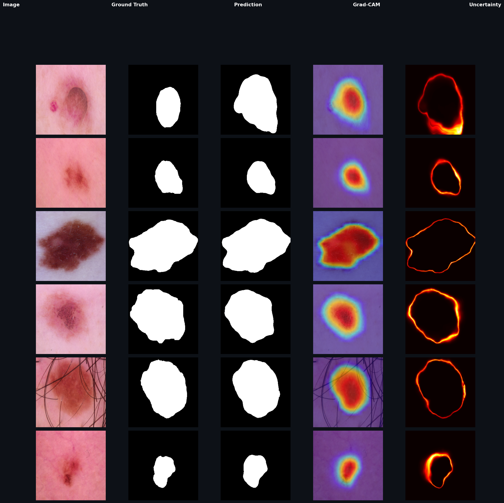

# GhostMTFormer

> Lightweight dual-encoder network for skin lesion segmentation on HAM10000

---

## Architecture


---

## Dataset

[HAM10000](https://dataverse.harvard.edu/dataset.xhtml?persistentId=doi:10.7910/DVN/DBW86T) — 10,015 dermoscopic images with expert segmentation masks

| Split | Images |
|-------|--------|
| Train | 8,012  |
| Val   | 1,001  |
| Test  | 1,002  |

---

## Results

## Results

> Evaluated on HAM10000 test set (1,002 images) with Test-Time Augmentation (TTA)

| Metric | Score |
|--------|-------|
| Dice   | 93.998% ± 8.65% |
| IoU    | 89.63% ± 11.89% |
| HD95   | 3.24 px |
| Params | 61.74M |

## Comparison

| Model | Dice | IoU | HD95 | Params |
|-------|------|-----|------|--------|
| GhostMTFormer (paper) | 90.64% | 84.05% | 12.82px | 13.57M |
| CFFormer | 92.20% | 86.55% | 3.06px | 99.56M |
| **GhostMTFormer v2 (this)** | **94.00%** | **89.63%** | **3.24px** | **61.74M** |

## Explainability



> Grad-CAM heatmaps show the model focusing on lesion boundaries.
> Uncertainty maps highlight ambiguous regions where expert review is recommended.
---

## Project Structure
GhostMTFormer/
├── configs/
│   └── default.yaml          # all hyperparameters
├── src/
│   ├── dataset.py            # HAM10000 data pipeline
│   ├── losses.py             # Dice + BCE + Tversky + Focal + Boundary
│   ├── metrics.py            # Dice, IoU, HD95
│   ├── train.py              # training loop
│   ├── evaluate.py           # test evaluation + TTA
│   └── model/
│       ├── ghost_encoder.py  # GhostNet local encoder
│       ├── global_encoder.py # CNN global encoder
│       ├── cfca.py           # cross-feature attention + XFF bottleneck
│       ├── decoder.py        # boundary-refined decoder
│       └── ghostmtformer.py  # full model assembly
├── notebooks/
│   └── gradcam_analysis.ipynb
└── requirements.txt

---

## Setup

```bash
git clone https://github.com/adhavan1801/GhostMTFormer.git
cd GhostMTFormer

python -m venv venv
venv\Scripts\activate          # Windows
pip install -r requirements.txt
```

---

## Training

```bash
python -m src.train
```

---

## Evaluation

```bash
python -m src.evaluate
```

---

## Environment

- Python 3.11
- PyTorch 2.7 + CUDA 12.8
- RTX 5060 8GB VRAM

---

## References

- [GhostNet](https://arxiv.org/abs/1911.11907) — Han et al., CVPR 2020
- [CFFormer](https://www.sciencedirect.com/science/article/pii/S0957417425003702) — Zhang et al., Expert Systems 2025
- [ECA-Net](https://arxiv.org/abs/1910.03151) — Wang et al., CVPR 2020
- [HAM10000](https://arxiv.org/abs/1803.10417) — Tschandl et al., 2018
